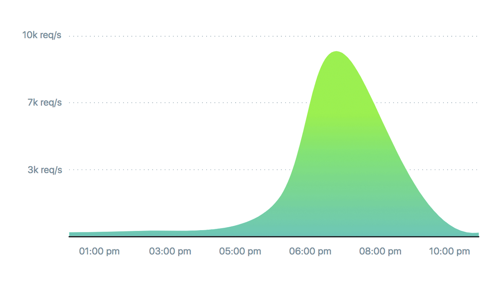
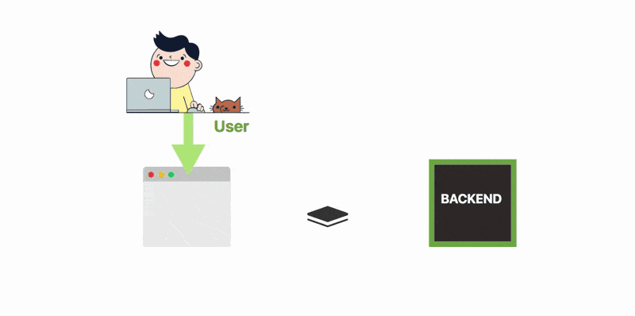
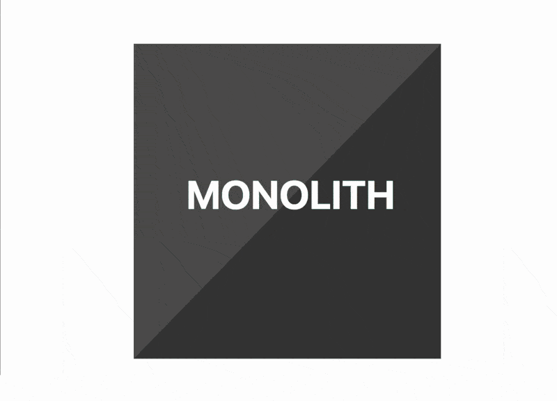

# Autoscaling on Kubernetes

When we design and build applications at scale, we should deal two main significant challenges: **scalability** and **robustness**.

Take any Online Store on Black Friday as an example.

That’s millions of people all buying an item at the same time.
If you were to picture any Trade store’s traffic as requests per second over time, this is what the graph could look like:



A good choice could be design the architecture to decouple the frontend and the backend with a technology component used as a queue.

The frontend posts messages to the queue, while the backend processes the pending messages one at the time.



The architecture has some obvious benefits:
* if the backend is unavailable, the queue acts as a buffer
* if the frontend is producing more messages than what the backend can handle, those messages are buffered in the queue
* you can scale the backend independently of the frontend — i.e. you could have hundreds of front-end services and a single instance of the backend

## Running with Docker

Run locally with Docker

```bash
docker-compose up
```

## Running with Kubernetes

You should have minikube installed.

You should start minikube with at least 4GB of RAM:

```bash
minikube start \
  --memory 4096 \
  --extra-config=controller-manager.horizontal-pod-autoscaler-upscale-delay=1m \
  --extra-config=controller-manager.horizontal-pod-autoscaler-downscale-delay=2m \
  --extra-config=controller-manager.horizontal-pod-autoscaler-sync-period=10s
```

> If you're using a pre-existing minikube instance, you can resize the VM by destroying it an recreating it. Just adding the `--memory 4096` won't have any effect.

## Installing Custom Metrics Api

Deploy the Metrics Server in the `kube-system` namespace:

```bash
kubectl create -f monitoring/metrics-server
```

After one minute the metric-server starts reporting CPU and memory usage for nodes and pods.

View nodes metrics:

```bash
kubectl get --raw "/apis/metrics.k8s.io/v1beta1/nodes"
```

View pods metrics:

```bash
kubectl get --raw "/apis/metrics.k8s.io/v1beta1/pods"
```

Create the monitoring namespace:

```bash
kubectl create -f monitoring/namespaces.yaml
```

Deploy Prometheus v2 in the monitoring namespace:

```bash
kubectl create -f monitoring/prometheus
```

Deploy the Prometheus custom metrics API adapter:

```bash
kubectl create -f monitoring/custom-metrics-api
```

List the custom metrics provided by Prometheus:

```bash
kubectl get --raw "/apis/custom.metrics.k8s.io/v1beta1"
```

Get the FS usage for all the pods in the `monitoring` namespace:

```bash
kubectl get --raw "/apis/custom.metrics.k8s.io/v1beta1/namespaces/monitoring/pods/*/fs_usage_bytes"
```

## Package the application

You package the application as a container with:

```bash
eval $(minikube docker-env)
docker build -t spring-boot-hpa .
```

## Deploying the application

Deploy the application in Kubernetes with:

```bash
kubectl create -f k8s/deployment
```

You can visit the application at http://minkube_ip:32000

> (Find the minikube ip address via `minikube ip`)

You can post messages to the queue by via http://minkube_ip:32000/submit?quantity=2

You should be able to see the number of pending messages from http://minkube_ip:32000/metrics and from the custom metrics endpoint:

```bash
kubectl get --raw "/apis/custom.metrics.k8s.io/v1beta1/namespaces/default/pods/*/messages"
```

## Autoscaling workers

You can scale the application in proportion to the number of messages in the queue with the Horizontal Pod Autoscaler. You can deploy the HPA with:

```bash
kubectl create -f k8s/hpa.yaml
```

You can send more traffic to the application with:

```bash
while true; do curl -d "quantity=1" -X POST http://minkube_ip:32000/submit ; sleep 4; done
```

When the application can't cope with the number of incoming messages, the autoscaler increases the number of pods in 3 minute intervals.

You may need to wait three minutes before you can see more pods joining the deployment with:

```bash
kubectl get pods
```

The autoscaler will remove pods from the deployment every 5 minutes.

You can inspect the event and triggers in the HPA with:

```bash
kubectl get hpa spring-boot-hpa
```

## Appendix

Using the secrets checked in the repository to deploy the Prometheus adapter is not recommended.

You should generate your own secrets.

But before you do so, make sure you install `cfssl` - a command line tool and an HTTP API server for signing, verifying, and bundling TLS certificates

You can find more [info about `cfssl` on the official website](https://github.com/cloudflare/cfssl).

Once `cfssl` is installed you generate a new Kubernetes secret with:

```bash
make certs
```

You should redeploy the Prometheus adapter.

## Recap

**Queue-based architecture** is an excellent design pattern to decouple your microservices and ensure they can be scaled and deployed independently.

And while you can roll out your deployment scripts, it’s easier to leverage a container orchestrator such as **Kubernetes** to deploy and scale your applications automatically.

## To be continued...

Smaller services are excellent from a product and development perspective.



Services that are tiny in size are:

* **quicker to deploy** — because you create and release them in smaller chunks
* **easier to iterate on** — since adding features happens independently
* **resilient** — the overall service can still function despite one of the components not being available
